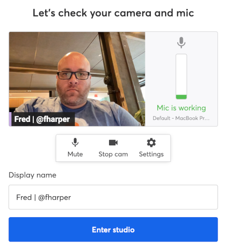

# Kubefirst Live

We have a [biweekly livestream](https://www.youtube.com/@kubefirst) named Kubefirst Live, where we are discussing not only kubefirst but anything cloud native.

Here are some guidelines for our guests.

## Guidelines

Firstly, we want you to have fun! It's important for us that you have a good time, and let's be honest, if you do, our viewers will too: it will translate in a better experience for everyone. With that said, here's some guidelines or things to keep in mind to help you get the best out of your livestream with us.

- [Goal](#goal)
- [Ambiance](#ambiance)
- [Format](#format)
- [Preparations](#preparations)
- [Platform](#platform)
- [Promotion](#promotion)
- [Tips](#tips)
- [Anything else?](#anything-else)

### Goal

The goal of the livestream is simple: we want to create valuable, fun, and educational content for our community. Whether it means sharing about the cool new features of our platform, or someone's else, it's all about helping developers, DevOps, and GitOps practitioners be successful. It's that simple!

### Ambiance

If you don't know us much yet, we are a bunch of happy people doing something we love. We are tackling serious problems in the cloud native space, without taking ourselves seriously. Kubefirst Live is no different: we are laid back. Do not stress out, it will be a fun discussion between friends. Demos may go wrong; that's OK. Internet connections may be flaky: that's OK. You may forget to say something important: that's OK. That's real life, so again, let's have fun, and things will be good.

### Format

We will discuss together the format of the livestream, but as a suggestion, here's the simple, but effective schedule we like when it's about showcasing your product:

- We are introducing the livestream, and everyone introduce themselves.
- You tell us about your product: what is it, what does it do, why should one use it, why do our community should care: it's the time to be shameless.
- This is the point where we jump into demonstration mode. We will install your software, tool or service on a cluster created with kubefirst. With everything working live, we can showcase what you just talked about.
- We conclude the livestream with some ways to get in touch with us. It's also the perfect moment for any last words.

We try to keep those on the 30-45 minutes length, but we are not policing time: as long as we have interesting content to share or discussion to have, we're good.

### Preparations

Once we agree on a date, we will send you two meetings request: one for the livestream, which will be booked for one hour and a half, so you don't have to rush to another meeting right after. Yes, we are that friendly. We will also send you a pre-show meeting, which is 15 minutes before, so we ensure everything is working video, and sound-wise, but any last-minute discussion. If you want, we can also schedule a 30 minutes a day or two before to discuss more in detail the flow of the show, but we try not to do any dry run to keep it natural, but we will be happy to schedule one if it makes you at ease.

You do not have to learn how kubefirst is working as we will take care of making work your product on our platform, and will let you know if we have any issues or questions. Still, it would be a good idea to [learn a little about our platform](https://docs.kubefirst.io) before the show. What you need to prepare is some slides, if you need them, for the part where you'll share about your product (see the [Format section](#format) for more information on that). The week of the livestream, we'll share with you the slides we'll use (we use Google Slides, so you'll need a Google account to edit them), in which you'll have a section to add yours. If you prefer, you can use your own slides: no worries, we'll just switch the screen to yours once it's your turn.

### Platform

We use [StreamYard](https://streamyard.com) as our livestream platform. The platform will stream the show on Kubefirst [YouTube channel](https://www.youtube.com/@kubefirst), [Twitter](https://twitter.com/kubefirst) account, [LinkedIn](https://www.linkedin.com/company/kubefirst/) page, [Twitch](https://www.twitch.tv/kubefirst) channel, and on [Kubeshop YouTube channel](https://www.youtube.com/@thekubeshop) (our parent company). You'll receive the link a couple of days before the livestream: you should open it to test everything is working. You'll need to give permission access to your webcam and microphone.

All [you need](https://support.streamyard.com/hc/en-us/articles/360043291612-Guest-instructions) is a modern browser, with a proper internet connection, a microphone, webcam, and headphones. We highly suggest you use headphones/earphones so there's no echo happening due to the microphone picking audio from the livestream.

_Click on the image for [a small video](https://youtu.be/H6YXleBZVRU) showing how to configure StreamYard_

When asked to enter your name: you can either add your full name or just your first one, whatever floats your boat. We only ask that if you are using Twitter, to add ` | @username` after your name. Lastly, be sure that in `Settings` > `Camera`, the `Camera resolution` combobox has `Full High Definition (1080p)` selected, for best video quality.

### Promotion

A couple of days before the stream, we will share on our [Twitter account](https://twitter.com/kubefirst), [LinkedIn page](https://www.linkedin.com/company/kubefirst/), [Slack community](https://kubefirst.io/slack), and in other related communities. We will tag your company. To help us spread the words, a retweet and reshare with your company's social media or even your personal ones are more than welcome.

## Tips

The previous items were specific to your participation to our livestream. We also want to share with you generic tips which could help you, and the audience to have a better experience when you are participating to any livestream, including ours.

- Reboot your machine: it ensures things will run smoothly.
- Close all unneeded applications: it frees up some memory, and CPU, which will be needed for the video, and may make any demos faster.
- If you will use the browser for showing or demo something, close all unneeded the tabs: it ensures the viewers are focusing on the right thing, and free up resources.
- Zoom the font in your IDE, terminal, and anything text-based so it shows well on any viewers' screen.
- As mentioned in the [Platform section](#platform), use earphones or headphones to prevent audio feedback. To check the audio quality of your microphone, use this [free tool from Adobe](https://podcast.adobe.com/miccheck).
- Ensure the lightning is good which may mean to close the blinds so there's no sun reflections on the webcam, open your ceiling lights even if it's daytime or anything else that can help you see your face properly.
- Activate the Do Not Disturb / Focus mode so there's no notification popups while you share your screen, nor any sound from notifications. There are tools that do this automatically for you, like the free [Muzzle application](https://muzzleapp.com) for macOS.
- Do the same with your phone, or at a minimum, put it on vibration. If you do the latter, don't leave it on the desk to prevent vibrations noises.
- If you are not living alone or are at the office, find a room where you can be alone, and close the door if possible. It will also be better for them. With that said, if your kids or animals want to be on the show, we're good with that!
- If your demo is complicated, require multiple steps, is too long, or if you think something could go wrong, for whatever reasons, prepare a final version with the end result as a safeguard. An example, when we want to show how to create an AWS cluster with kubefirst, we will show how to get started, but because the full process is about 25 minutes (multiple resources are needed on AWS to create a production-ready Kubernetes cluster), we will have another cluster already created.

## Anything else?

If at any moments you need help with your slides, wants some feedback, have questions about kubefirst or the livestream itself, contact [Fred](mailtohttps://fred.dev@kubeshop.io).

Looking forward to discussing your technology, and dropping some knowledge bomb to our audience with you.

 — The Kubefirst team
